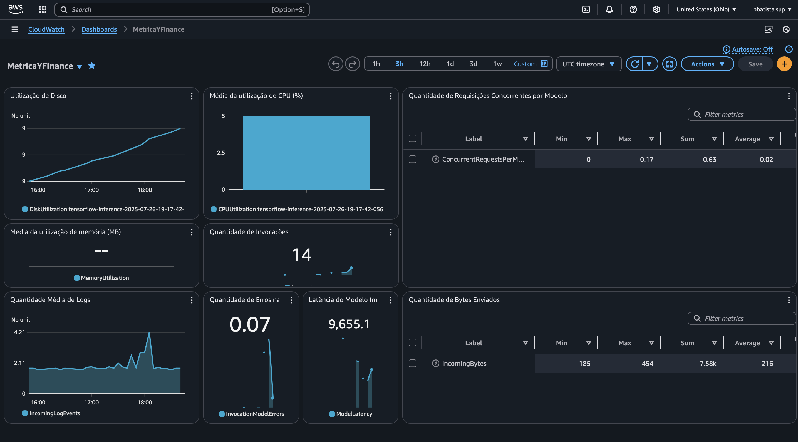

# 📈 FIAP_PROJECTS_04: Previsão de Fechamento de Ações com LSTM e FastAPI 

Este projeto é o resultado do **Tech Challenge da Fase 4 da Pós-Tech MLET FIAP**, cujo desafio consistia em desenvolver uma pipeline completa de **Deep Learning com LSTM** para prever o valor de fechamento de ações de uma empresa à escolha, fazer o **deploy do modelo** e disponibilizá-lo via **API** em produção.

## 💼 Desafio proposto (resumo)
De acordo com o documento oficial [Pos_Tech_Fase4.pdf], os requisitos incluíam:
- Coletar e pré-processar dados históricos de ações
- Construir e treinar um modelo preditivo com LSTM
- Salvar o modelo treinado para inferência
- Fazer o deploy com **SageMaker**
- Disponibilizar uma API RESTful (FastAPI ou Flask)
- Monitorar a performance do modelo com **Amazon CloudWatch**

---

## 🔁 Pipeline de Desenvolvimento

### 1. 📊 Coleta, Pré-processamento e Treinamento (`criacao_modelo.ipynb`)
- Utilizamos a biblioteca `yfinance` para coletar os dados da ação **ITUB4.SA**
- Normalizamos os dados e dividimos em conjuntos de treino/teste
- Criamos o modelo com uma arquitetura LSTM simples, otimizando hiperparâmetros
- Exemplo de coleta:

```python
import yfinance as yf

symbol = 'ITUB4.SA'
df = yf.download(symbol, start='2018-01-01', end='2024-07-01')
```

- Avaliação com métricas: MAE, RMSE e MAPE

---

### 2. 🚀 Deploy no SageMaker (`deploy_modelo.ipynb`)
- Salvamos o modelo em formato `SavedModel` do TensorFlow
- Criamos o endpoint no **Amazon SageMaker**
- Validamos o endpoint com `boto3` usando uma entrada de teste

---

### 3. 📈 Monitoramento com CloudWatch (`dashboard.png`)
Criamos um dashboard no **Amazon CloudWatch** com as seguintes métricas:
- Utilização de Disco, CPU e Memória
- Quantidade de Invocações
- Latência do Modelo
- Taxa de Erros
- Requisições Concorrentes



---

### 4. 🔌 API com FastAPI (`API_main.py`)
Desenvolvemos uma API hospedada em instância EC2 com as seguintes rotas:

#### `GET /`
Página inicial com resumo da API

#### `GET /fechamento/hoje`
Retorna a previsão do fechamento de **hoje (D+0)** com base nos últimos 60 dias úteis de fechamento.

#### `GET /fechamento/proximos`
Retorna a previsão para os **próximos 5 dias úteis (D+1 até D+5)**, fazendo previsão iterativa.

**Exemplo de chamada do modelo com boto3:**

```python
response = runtime.invoke_endpoint(
    EndpointName=ENDPOINT,
    ContentType="application/json",
    Body=json.dumps(payload),
)
result = json.loads(response["Body"].read())
```

---

## 📁 Estrutura de Arquivos

| Arquivo | Descrição |
|--------|-----------|
| `criacao_modelo.ipynb` | ETL, construção e avaliação do modelo |
| `deploy_modelo.ipynb` | Deploy e testes com endpoint no SageMaker |
| `dashboard.png` | Captura do painel de monitoramento no CloudWatch |
| `API_main.py` | Código da API FastAPI com chamadas ao modelo |
| `Pos_Tech_Fase4.pdf` | Enunciado do desafio proposto |

---

## ✅ Conclusão

O projeto atendeu todos os requisitos propostos:
- Modelo LSTM funcional com bom desempenho
- Deploy efetivo no SageMaker
- API responsiva com inferência real
- Monitoramento ativo em produção

Este projeto demonstra habilidades práticas em **Machine Learning aplicado a séries temporais**, **deploy na nuvem**, e **engenharia de APIs** com observabilidade.

---

> Projeto desenvolvido como parte da Pós-Tech MLET – Fase 4 (FIAP)
